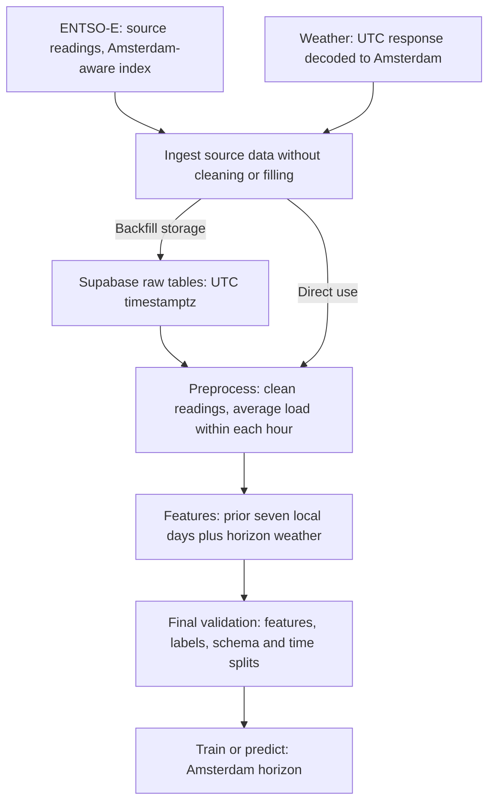

# Pipeline flow and timezone boundaries

The pipeline forecasts Netherlands electricity load for one Amsterdam calendar
day at a time. Use `Europe/Amsterdam` to define forecast dates, history windows,
and calendar features. Use UTC for external weather requests and database
storage. Converting between these zones preserves the underlying instant. Load preprocessing stays
Amsterdam-aware and averages available readings without interpolation.

This document describes the current implementation. Ingestion, backfill,
preprocessing, features, and point/quantile models exist. The historical
training entry point is `python3 -m entso_e_pipeline.offline.train`; conformal
interval calibration, live forecast/reconciliation commands, and reports are
included.

## 1. Overall flow

The timestamp index identifies each observation. It is not a numeric model
feature. Calendar fields extracted from that index are model features.

## 2. Which timezone belongs where?

| Boundary or operation | Time representation | Reason |
| --- | --- | --- |
| Configured dates and caller-supplied unzoned bounds | Amsterdam | A forecast day means a Netherlands calendar day. |
| Bounds passed to `client.query_load` | Aware Amsterdam timestamps | This is what our load adapter passes to the client. |
| Raw load/weather timestamps without an offset | Interpreted as UTC, then converted to Amsterdam | Source rows use a different default from request bounds. |
| Raw timestamps already carrying an offset | Preserve the instant; convert to Amsterdam | Explicit source offsets must not be overwritten. |
| Load adapter output | Source resolution with an aware Amsterdam index | The ENTSO-E client already supplies this timezone. |
| Load preprocessing and hourly averaging | Aware Amsterdam index | Each hourly mean uses available readings within that real hour. |
| Weather request dates and request chunk boundaries | UTC | The adapter explicitly requests UTC output and chunks UTC dates. |
| Supabase `timestamptz` columns | UTC instants | Repeated autumn clock hours remain distinct in storage. |
| Loaded backfill, forecast horizon, calendar dates, history cutoff | Aware Amsterdam index | Align all daily decisions with the local calendar. |
| Internal load-feature reference grid | Unzoned Amsterdam clock labels | Apply the explicit same-clock-hour DST policies described below. |
| Model prediction wrapper | Preserves its input feature index | Features built by this pipeline carry the Amsterdam horizon. |

Amsterdam is UTC+01:00 in winter and UTC+02:00 in summer. Always use the named
zone `Europe/Amsterdam`; a fixed `+01:00` offset cannot represent the full year.

### Request bounds and source rows have different defaults

The distinction lives in [time_utils.py](entso_e_pipeline/time_utils.py):

| Helper and input | Result |
| --- | --- |
| `as_local("2026-07-01 00:00", TIMEZONE)` | `2026-07-01 00:00+02:00`: an unzoned request bound is local. |
| `as_local_index(["2026-07-01 00:00"], TIMEZONE)` | `2026-07-01 02:00+02:00`: an unzoned source row is UTC. |
| Either helper with `2026-06-30T22:00:00Z` | `2026-07-01 00:00+02:00`: the supplied instant is preserved. |

Attaching a zone to an unzoned value interprets its clock reading. Converting
an already zoned value changes its representation without moving the instant.
Supply explicit offsets when a timestamp could otherwise be ambiguous.

## 3. Window boundaries and DST

Pipeline windows use `[start, end)`: include `start`, exclude `end`. The end of
a forecast day is the next **local midnight**, not 24 elapsed hours after its
start. `local_day_hours` constructs this window using a calendar-day offset.

| Forecast date | Amsterdam window | Equivalent UTC window | Hourly rows |
| --- | --- | --- | --- |
| Winter: 2026-01-10 | Jan 10 00:00+01 → Jan 11 00:00+01 | Jan 9 23:00Z → Jan 10 23:00Z | 24 |
| Summer: 2026-07-01 | Jul 1 00:00+02 → Jul 2 00:00+02 | Jun 30 22:00Z → Jul 1 22:00Z | 24 |
| Spring DST: 2026-03-29 | Mar 29 00:00+01 → Mar 30 00:00+02 | Mar 28 23:00Z → Mar 29 22:00Z | 23 |
| Autumn DST: 2026-10-25 | Oct 25 00:00+02 → Oct 26 00:00+01 | Oct 24 22:00Z → Oct 25 23:00Z | 25 |

On the spring date, the clock jumps from 01:00+01 to 03:00+02. On the autumn
date, both of these rows exist:

| Amsterdam timestamp | UTC instant |
| --- | --- |
| `2026-10-25 02:00+02:00` | `2026-10-25 00:00Z` |
| `2026-10-25 02:00+01:00` | `2026-10-25 01:00Z` |

These are different observations, not duplicate timestamps. Keep both in load,
weather, labels, and predictions. Hourly validation checks real one-hour steps
and alignment in UTC; local clock labels may skip or repeat.

## 4. Load ingestion: preserve source readings

Source: [ingestion/load.py](entso_e_pipeline/ingestion/load.py).

1. `fetch_load(start, end)` interprets bounds in Amsterdam and passes aware
   timestamps to the ENTSO-E client for country `NL`.
2. The client returns an Amsterdam-aware index. The adapter trims observations
   to `[start, end)` and returns them at their source resolution.
3. Missing readings, duplicates, and invalid values remain in the response for
   preprocessing. Ingestion does not average or interpolate load.

## 5. Preprocessing: clean, then average within each hour

Source: [preprocessing.py](entso_e_pipeline/preprocessing.py).

`prepare_load` sorts source readings, collapses identical duplicates, converts
invalid numeric readings to missing values, and takes the mean of the available
readings in each real hour. It does not infer cadence, interpolate, or fill from
adjacent hours. Three valid quarter-hour readings produce their own mean; an
entirely missing hour stays missing.

For example, readings `100, 110, 120, missing` produce `110`. This can differ
from the unavailable complete-hour average, but avoids estimating a fourth
reading. The same policy defines hourly history and hourly labels.

Pass both `start` and `end` to retain missing boundary hours in the output.
Without both bounds, the output covers the available observations. All averaging
uses Amsterdam-aware timestamps, preserving both autumn hours separately.

`prepare_weather` cleans already-hourly forecasts without filling gaps or
switching weather sources. Missing weather rows become missing feature values
when feature engineering aligns them to the horizon.

Conflicting duplicates or missing timestamps cannot be resolved by averaging
and still raise errors. Completeness and finite-value checks happen after
feature construction, at the model boundary.

## 6. Weather ingestion: local demand window to UTC requests

Source: [ingestion/weather.py](entso_e_pipeline/ingestion/weather.py).

1. `pull_forecast(start, end)` interprets bounds in Amsterdam, validates whole
   hours, and converts both bounds to UTC.
2. The adapter splits the window into requests spanning at most 14 UTC dates.
   Intermediate chunks end at UTC midnight. Adjacent requests do not repeat
   UTC dates.
3. Requests select JMA GSM (`jma_gsm`), the configured Amsterdam coordinates,
   Celsius, and `timezone="UTC"`.
4. The selected fields are `apparent_temperature_previous_day2` and
   `dew_point_2m_previous_day2`. They are renamed to `apparent_temperature`
   and `dew_point_2m` in the returned frame.
5. Response timestamps are interpreted as UTC and converted to Amsterdam.
   The adapter trims the provider's date-sized response to the exact requested
   instants. Missing observations are preserved for preprocessing and final
   validation. Required payload fields and units are checked when decoding.

The provider's date bounds are inclusive. The adapter turns our exclusive
`end` into the date containing `end_utc - 1 hour`. For the Amsterdam day
July 1, 2026, it requests UTC dates June 30 through July 1, then keeps only
`[June 30 22:00Z, July 1 22:00Z)`.

`pull_historical_weather` calls the same function as live weather ingestion.
The two-day setting chooses older forecast values; it does **not** shift their
valid timestamps back two days. Weather still joins to the forecast hour it
describes. This fixed lead policy is separate from the one-calendar-day load
lag and does not reconstruct one specific weather run issued at local midnight.

## 7. Backfill and raw storage boundaries

Source: [offline/backfill.py](entso_e_pipeline/offline/backfill.py).

The default load window is `[2018-12-25, 2026-09-16)` in Amsterdam. Weather
covers `[2019-01-01, 2026-09-16)`. The extra seven local days of load provide
history for the first training day.

`BackfillSpec.chunk_days` splits load requests into local calendar windows.
The downloader passes the entire weather window to the weather adapter, which
owns UTC request chunking. The downloader upserts source readings directly into
the Supabase raw tables without normalizing them again. Missing readings are
retained as missing values or absent rows, rather than causing the download to
fail.

[supabase/schema.sql](supabase/schema.sql) stores source-resolution observations
with UTC `timestamptz` columns and upserts revisions by observation timestamp.
`python3 -m entso_e_pipeline.offline.backfill` is the only historical ingestion
command. `python3 -m entso_e_pipeline.offline.materialize` writes the versioned
hourly and feature tables, and `python3 -m entso_e_pipeline.offline.train` reads
those materialized features. The schema also stores model versions, forecast
runs, hourly point/quantile outputs, actuals when they arrive, and daily error
metrics. Forecast timestamps remain UTC in storage and are interpreted as
Amsterdam horizons by the forecasting layer. Derived tables can be rebuilt from
raw observations when processing or feature definitions change.

## 8. Daily features and the history cutoff

Sources: [features/engineering.py](entso_e_pipeline/features/engineering.py)
and [features/load.py](entso_e_pipeline/features/load.py).

For forecast date `D`, `engineering.transform` requires a horizon containing
one complete Amsterdam day. It converts an aware horizon to Amsterdam and
selects preprocessed load history in `[D - 7 calendar days, D)` before
constructing features. It reindexes that history onto the expected hourly grid.
Missing history remains missing and can be examined before final validation.

Forecast-day and later rows in the supplied load frame are excluded. Weather
is selected for the horizon itself. It is optional, but must be consistently
included or omitted to match the trained model's feature columns.

For the forecast row January 10, 2026 at 09:00 Amsterdam:

| Feature | Reference |
| --- | --- |
| `load_lag_1d_same_clock_hour` | January 9 at 09:00 |
| `load_lag_7d_same_clock_hour` | January 3 at 09:00 |
| `load_mean_24_clock_hours_ending_1d_ago` | 24 clock-hour slots from January 8 at 10:00 through January 9 at 09:00 |
| Calendar and holiday fields | January 10 at 09:00, interpreted in Amsterdam |
| Weather fields | Forecast weather valid for January 10 at 09:00 |

A calendar-day lag can span 23 or 25 elapsed hours at DST changes. It is not
equivalent to shifting data by 24 rows.

### The internal clock grid

`CalendarLoadFeatures` temporarily removes the timezone from Amsterdam clock
labels to build its reference grid. This grid applies these policies:

- A repeated reference hour becomes the mean of its two actual readings.
- A nonexistent spring reference hour becomes the mean of its adjacent 01:00
  and 03:00 readings.
- Both occurrences of a repeated forecast hour receive the same reference
  features.
- Rolling means use 24 clock-hour slots, including these averaged or
  interpolated reference slots.

This special grid is only for reference lookups. Feature output is put back on
the original aware horizon, retaining its 23, 24, or 25 real hourly instants.
Do not use the unzoned clock grid as the storage or prediction index.

`CalendarFeatures` then extracts hour, weekday, month, and weekend directly
from the Amsterdam index. Holiday fields use Amsterdam dates. Fixed categorical
definitions keep these columns consistent across training and prediction.

## 9. Final validation, training, and predictions

`build_labeled_features` runs the same daily feature path for every eligible day
and attaches preprocessed hourly `Actual Load` labels afterward. It discards the
initial seven full local days used for history. A partial initial day is excluded
from that lookback. Both feature transformers are stateless.

Feature engineering does not fill or silently drop unresolved gaps. Final checks
in `modeling/schema.py` reject missing features, missing labels, infinite values,
invalid categories, and invalid time indexes. `split_target` validates labeled
frames; `validate_features` validates unlabeled inputs. Training and prediction
wrappers perform their final checks automatically. A partial final label day
therefore fails here, after construction, rather than during ingestion.

Configured evaluation windows are local and half-open:

| Split | Amsterdam window | Intended role |
| --- | --- | --- |
| Training | `[2019-01-01, 2026-01-01)` | Fit the selection models. |
| Validation | `[2026-01-01, 2026-04-01)` | Select boosting rounds. |
| Calibration | `[2026-04-01, 2026-07-01)` | Calibrate uncertainty after refitting. |
| Test | `[2026-07-01, 2026-09-16)` | Evaluate the calibrated model. |

History can cross a split boundary: January 1 validation features need late
December load. Construct each evaluation day's features using the available
prior history, then attach labels from that day's split. Starting feature
construction from an isolated validation frame would lose its first seven days.

The point and quantile training wrappers share validation and training code in
[modeling/_shared.py](entso_e_pipeline/modeling/_shared.py). The historical
entry point is [offline/train.py](entso_e_pipeline/offline/train.py). Selection requires
chronological, non-overlapping training and validation frames. Final fitting
uses their combined data and the previously selected round count; each quantile
has its own count. Calibration and test labels stay out of fitting and early
stopping. The training entry point validates all four configured splits together,
fits one split-conformal widening value on calibration, and reports MAE, MAPE,
pinball loss, and final q10–q90 coverage on the untouched test period. The
calibration adjustment is not refit on test data.

For prediction, provide only feature columns. The wrapper checks their schema,
reorders them to match the model, and returns a series with the input index.
There is no additional UTC conversion at the model boundary. Point predictions
and the 0.1, 0.5, and 0.9 quantile predictions therefore retain the Amsterdam
horizon supplied by feature engineering.

`PRODUCTION_SPLITS` describes a separate later fit through June 2026, followed
by calibration on July–September. Those calibration dates no longer constitute
an independent test set for that production model.

## 10. Interpolation removal and existing data

The earlier cross-midnight leak is removed from the new processing path.
No next-day observation can affect the previous hour's mean, so preprocessing
can run on the full archive before daily features are constructed. A missing
quarter-hour uses the other readings in that hour; a completely missing hour
remains missing for final validation.

The DST reference-grid policy is retained because a nonexistent local clock
hour needs a defined lookup. That is separate from filling missing source data.

The old local snapshots were created by an earlier interpolation/aggregation
path. They are not part of the current runtime and cannot be used to recover
source readings. Refresh the Supabase raw tables with `offline.backfill` before
a trustworthy new evaluation.

## 11. Live execution

`online.forecast` uses the Amsterdam forecast date as its cutoff. It first
ensures the preceding seven local calendar days have complete hourly load
history, catching up from the first missing day when necessary. It then fetches
the forecast-day weather, materializes the live hourly/features rows, loads the
newest model bundle from DagsHub MLflow, and stores the forecast run and
calibrated q10/q50/q90 values in Supabase.

`online.reconcile` runs after forecast days close. With no explicit date, it
selects the oldest latest forecast run without daily metrics, ingests the
completed actual load, attaches actuals to the stored forecast values, and
writes daily MAE, MAPE, pinball loss, and interval coverage. If required actual
history is unavailable, reconciliation fails without fabricating values and the
workflow retries it later.

The GitHub Actions schedule uses `Europe/Amsterdam`, so daylight-saving
changes do not require separate UTC cron entries. A manual dispatch should be
used before enabling unattended runs.
